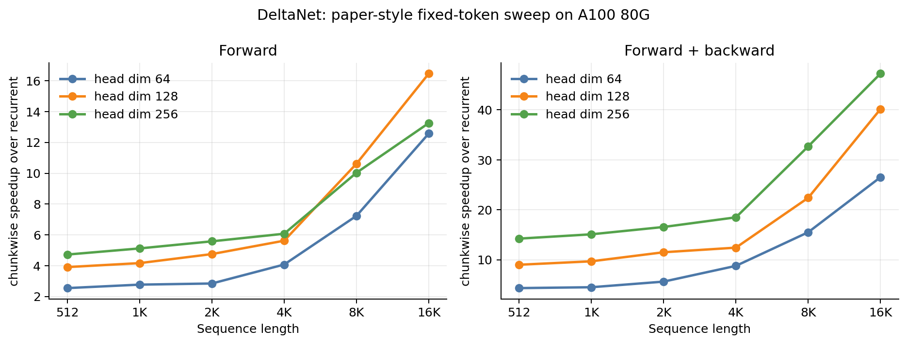
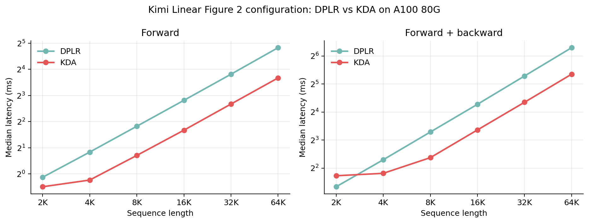
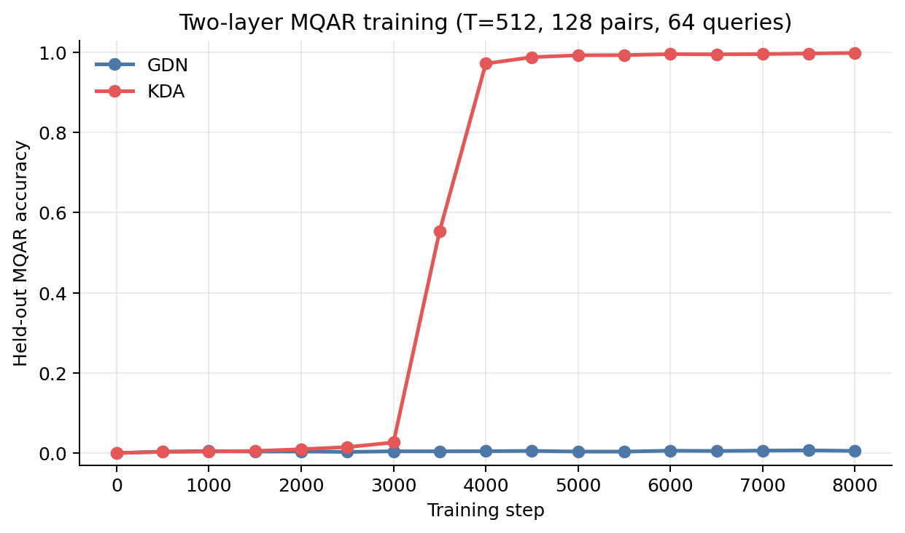
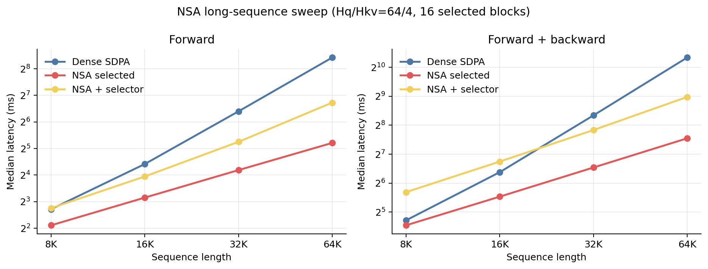

# Sparse 与 Linear Attention 调研及复现报告

> 报告版本：2026-08-28  
> 研究重点：核心算法、chunkwise/tiled GPU kernel、训练与推理性能
> 引用格式：正文中的 `[@key]` 对应
> [`references/attention.bib`](https://github.com/Huasushis/sparse-linear-attention/blob/study/sparse-linear-attention/references/attention.bib)

## 摘要

标准 softmax attention 需要为每个 query 与所有可见 key 建立配对，计算量随序列长度
$T$ 以 $O(T^2D)$ 增长。降低长上下文成本主要形成了三条路线：第一，FlashAttention
保持 dense softmax 的数学定义不变，通过 tiling、online softmax 与重计算减少 HBM
读写；第二，linear attention 把历史压入固定形状的 recurrent state，并用 parallel、scan
或 chunkwise 算法恢复训练并行；第三，sparse attention 只计算结构规则或动态选择后的
query-key 子集，并围绕 selector、block layout、在线归一化和 serving cache 设计 kernel。

本报告从 dense attention 出发，依次讲清 linear attention 如何把历史压缩为固定大小的
状态、sparse attention 如何选择少量 query-key 配对，以及这些算法怎样落实成 GPU 上的
chunk、tile、scan 和 fused kernel。重点方法包括 GLA、DeltaNet、Gated DeltaNet（GDN）、
Kimi Delta Attention（KDA）、Mamba-2/SSD、MInference、Native Sparse Attention（NSA）、
MoBA、SpargeAttention 和 HiLS-Attention。复现使用 FLA 官方实现，在 107 Slurm 集群上完成
前向、反向、显存和长序列参数扫描，并用 MQAR 小模型训练观察 GDN/KDA 的实际学习效果。

## 1. 背景与研究问题

Transformer 的 attention 让每个 token 直接读取其他 token，因此比 RNN 更容易并行训练，
也更擅长长距离信息交互。它的主要代价来自两两配对：长度为 $T$ 的序列会产生
$T\times T$ 个 attention score。上下文从 4K 增长到 64K 时，token 数增加 16 倍，score
数增加 256 倍。训练和 prefill 需要完成大量矩阵乘法，decode 则需要在每一步读取越来越长
的 KV cache。

现有方法主要沿三条路线发展：

| 路线 | 核心做法 | 保存的历史 | 代表方法 |
| --- | --- | --- | --- |
| Dense kernel 优化 | 保留完整 softmax attention，改变数据在 HBM 与 SRAM 间的流动方式 | 完整 K/V | FlashAttention |
| Linear attention | 把历史 key-value 累积到固定形状的矩阵状态 | recurrent state | GLA、DeltaNet、GDN、KDA、Mamba-2/SSD |
| Sparse attention | 为每个 query 计算局部窗口或动态选出的少量 KV block | 稀疏 KV 子集或完整 KV cache | MInference、NSA、MoBA、Sparge、HiLS |

这三条路线分别优化了数据流、历史表示和配对数量。它们可以组合：例如 sparse kernel 仍然
使用 FlashAttention 的 online softmax，Kimi Linear 则把三层 KDA 与一层全局 MLA 交错。

本报告围绕四个问题展开：

1. 每种方法如何表示和更新历史信息；
2. recurrent、parallel、chunkwise 三种计算形式如何互相转换；
3. chunk、tile、WY 表示和 online softmax 如何映射到 GPU；
4. 算法复杂度、kernel 时间、训练效果和 serving 指标之间是什么关系。

评价一个新方法时需要同时看“学得怎样”和“跑得怎样”。固定训练 token 比较相同数据预算
下的效果，固定 FLOPs 比较相同理论计算预算，固定 GPU 时间比较相同实际成本；validation
loss、下游准确率、time-to-quality、吞吐、峰值显存、TTFT 和 TPOT 共同构成完整结果。

## 2. Dense attention 与性能基线

### 2.1 数学定义

对一个 head，设 $Q,K\in\mathbb R^{T\times D}$、$V\in\mathbb R^{T\times D_v}$：

$$
S=\frac{QK^\top}{\sqrt D},\qquad
P=\operatorname{softmax}(S+M),\qquad
O=PV,
$$

其中 causal mask $M_{ij}=0$（$j\le i$），否则为 $-\infty$。逻辑 score/probability
矩阵为 $T\times T$，所以主计算量为 $O(T^2D)$。训练、prefill 和 decode 的形态不同：

- 训练/prefill 同时处理大量 query，适合大块 GEMM；
- 单步 decode 通常 $T_q=1$，历史 $K/V$ 来自 KV cache，常受显存带宽与调度限制；
- KV cache 随上下文长度增长，而历史 query 不需要保存。

### 2.2 FlashAttention：用分块数据流计算完整 attention

FlashAttention 计算完整的 dense softmax attention。朴素路径将 $S$、$P$ 写入 HBM；
FlashAttention 将 $Q$ 切为行 tile，将 $K/V$ 切为列 tile，让临时 score 在片上产生、
消费后丢弃，只维护每个 query 行的 running maximum、normalizer 和未归一化输出
[@dao2022flashattention]。

对新 score block $s_b$，online softmax 维护

$$
m=\max s,\quad l=\sum_j e^{s_j-m},\quad
u=\sum_j e^{s_j-m}v_j.
$$

若 $m'=\max(m,\max s_b)$，则

$$
l'=e^{m-m'}l+\sum_{j\in b}e^{s_j-m'},
$$

$$
u'=e^{m-m'}u+\sum_{j\in b}e^{s_j-m'}v_j,\qquad o=u'/l'.
$$

旧状态必须乘 $e^{m-m'}$，否则两个 block 使用不同指数基准。causal kernel 还可以跳过
对角线上方的整块，对角块才做逐元素 mask。Backward 不保存完整 $P$，而是在 tile 内重算
score/probability，再累积 $dQ,dK,dV$；这增加部分 FLOPs，却减少 activation 与 HBM 流量。

FlashAttention-2 进一步减少非 matmul FLOPs、增加 sequence 维并行并改进 warp 间工作
划分 [@dao2024flashattention2]。FA-3/4 利用 Hopper/Blackwell 的异步 pipeline 与低精度
继续提高新架构上的吞吐 [@shah2024flashattention3; @zadouri2026flashattention4]。

### 2.3 Dense kernel 的 tile 生命周期

```text
HBM: Q_i ---------------------------┐
HBM: K_j,V_j -> SRAM/register tile  |
                    |               |
             Q_i K_j^T              |
                    | mask          |
                    v               |
          online (m,l,u) update ----┘  对所有可见 KV tile 循环
                    |
                    v
                 write O_i
```

这种数据流省去了完整 $T\times T$ 中间量的 HBM 写回，并在片上反复使用 Q/K/V tile。
因此本报告使用成熟 SDPA/FlashAttention 作为 dense 性能基线，显式 PyTorch 承担公式验证。

## 3. Linear attention：算法分类与原理

### 3.1 从 softmax kernel 到 recurrent state

若相似度核可写或近似为

$$
\kappa(q,k)\approx\phi(q)^\top\phi(k),
$$

则 causal attention 可以交换求和次序。定义

$$
S_t=\sum_{i\le t}v_i\phi(k_i)^\top
\in\mathbb R^{D_v\times D_\phi},\qquad
z_t=\sum_{i\le t}\phi(k_i)\in\mathbb R^{D_\phi},
$$

$$
o_t=\frac{S_t\phi(q_t)}
          {\phi(q_t)^\top z_t+\varepsilon}.
$$

状态更新为

$$
S_t=S_{t-1}+v_t\phi(k_t)^\top,\qquad
z_t=z_{t-1}+\phi(k_t).
$$

softmax 的未归一化 kernel 是 $\exp(q^\top k)$。它确实存在内积特征展开：

$$
e^{q^\top k}
=\sum_{r=0}^{\infty}\frac{(q^\top k)^r}{r!}
=\left\langle
\bigoplus_{r=0}^{\infty}\frac{q^{\otimes r}}{\sqrt{r!}},
\bigoplus_{r=0}^{\infty}\frac{k^{\otimes r}}{\sqrt{r!}}
\right\rangle.
$$

这个精确特征是无限维的。Performer 从高斯分布采样 $\omega$，使用正随机特征

$$
\phi_\omega(x)=\exp\left(\omega^\top x-\frac{\|x\|_2^2}{2}\right),
$$

它满足

$$
\mathbb E_\omega[\phi_\omega(q)\phi_\omega(k)]=e^{q^\top k}.
$$

采样 $D_\phi$ 个 $\omega$ 就得到有限维近似。另一类方法直接选择
$\phi(x)=\operatorname{ELU}(x)+1$、ReLU、SiLU 等正特征，再配合新的归一化和训练方式。
从矩阵角度看，$\Phi(Q)\Phi(K)^\top$ 的秩最多为 $D_\phi$，因此特征维度也决定了这张
近似 attention map 能表达多少独立的匹配模式。

当 $D_\phi,D_v$ 固定时，关于序列长度的工作为 $O(TD_\phi D_v)$，decode state 不随
$T$ 增长。这是“Transformers are RNNs”的基本形式 [@katharopoulos2020transformers]。
Performer 用随机正特征近似 softmax kernel [@choromanski2021rethinking]；cosFormer 等
直接采用新的特征或归一化 [@hua2022transformer]。有限维 state 将全部历史压缩到固定
容量，其表达能力取决于特征维度、更新规则和遗忘机制。

### 3.2 Recurrent、parallel 与 chunkwise 三种计算形式

三种形式描述的是同一个 operator 的不同执行计划：

| 形式 | 数据依赖 | 适合阶段 | 主要 kernel 特征 |
| --- | --- | --- | --- |
| recurrent | 每 token 依赖前一 state | decode、正确性 oracle | 固定 state；并行量小、频繁读写 state |
| parallel/scan | 展开全部位置 | 训练、短 prefill | 并行强；可能产生大中间量 |
| chunkwise | chunk 间递推、chunk 内并行 | 训练、长 prefill | 大部分工作转 GEMM；保留少量 boundary state |

对最简单的 additive state，令一个 chunk 的 $Q,K\in\mathbb R^{C\times D_k}$、
$V\in\mathbb R^{C\times D_v}$，则

$$
S_{c+1}=S_c+V_c^\top K_c,
$$

$$
O_c=\underbrace{Q_cS_c^\top}_{\text{inter-chunk}}
 +\underbrace{\bigl((Q_cK_c^\top)\odot M_C\bigr)V_c}_{\text{intra-chunk}}.
$$

串行边界从每 token 一次降为每 chunk 一次；块内使用 $C\times D$ 与 $D\times C$ GEMM。
GLA 论文指出 $C$ 取 Tensor Core 友好的倍数（如 16 的倍数）有利于利用矩阵乘，并通过
tiling 在片上复用张量块，减少 HBM 往返 [@yang2024gated]。FLA 固定提交中 GDN 支持
chunk size 16/32/64，KDA 支持 32/64，默认均为 64。

### 3.3 GLA：主动遗忘

GLA 为普通累加 state 加入数据依赖的 key-channel gate：

$$
S_t=S_{t-1}\operatorname{Diag}(\boldsymbol\alpha_t)+v_tk_t^\top,
\qquad \boldsymbol\alpha_t\in(0,1)^{D_k}.
$$

不同通道可以有不同记忆寿命。它仍是 additive write：相同 key 的新旧 value 可能叠加。
GLA 的研究贡献同时包括模型机制与 I/O-aware chunkwise training，二者需要模型消融和
operator benchmark 两套证据 [@yang2024gated]。

### 3.4 Delta rule：沿当前 key 方向擦除再写入

令 state 方向为 $S_t\in\mathbb R^{D_v\times D_k}$，旧预测为
$\hat v_t=S_{t-1}k_t$。DeltaNet 更新为

$$
S_t=S_{t-1}+\beta_t(v_t-\hat v_t)k_t^\top.
$$

它也可由在线最小二乘得到。令

$$
L_t(S)=\frac12\|S k_t-v_t\|_2^2,
$$

则

$$
\nabla_SL_t=(S k_t-v_t)k_t^\top,
$$

一次步长 $\beta_t$ 的梯度下降即为上式。展开得到

$$
S_t=S_{t-1}(I-\beta_tk_tk_t^\top)+\beta_tv_tk_t^\top.
$$

$I-\beta kk^\top$ 是 rank-1 修正的 generalized Householder transition；kernel 直接使用
$k$ 与 $\beta$ 完成这次修正。DeltaNet 使用 compact WY 表示压缩一串 rank-1
transition，使 chunk 内 pseudo-key/pseudo-value 与边界 state 的计算转为 GEMM，并避免为
每个 token materialize 矩阵 state [@yang2024delta]。

### 3.5 GDN：gate 与 delta 的组合

GDN 先以每 head scalar gate 衰减，再执行 delta write：

$$
\bar S_t=S_{t-1}\alpha_t,
$$

$$
S_t=\bar S_t+\beta_t(v_t-\bar S_t k_t)k_t^\top.
$$

$\alpha$ 决定旧状态寿命，$\beta$ 决定当前 key 方向的纠正幅度。论文在合成 recall、语言
模型和 LongBench 中验证了这种组合，并在单张 H100 上报告了与 DeltaNet 接近的训练吞吐
[@yang2025gated]。

### 3.6 Mamba-2 / SSD：state-space 与 attention 的块对偶

SSD 将一类 scalar-identity state transition 的 SSM 写成结构化半可分（semiseparable）
矩阵，也可以反向把 attention 看作结构化矩阵乘。其工程意义是：同一 operator 可在
recurrent state、卷积/scan、block matrix 三种视角中选择执行计划；结构化 transition
带来了块算法与 Tensor Core 友好性 [@dao2024transformers]。SSD/Mamba-2、GDN 和 KDA
都维护固定矩阵 state，并分别使用 scalar transition、gated delta 和 channel-wise delta 更新。

### 3.7 KDA 与 Kimi Linear：GDN 的细粒度扩展

KDA 把 GDN 的 scalar decay 换为 key-channel diagonal decay：

$$
\bar S_t=S_{t-1}\operatorname{Diag}(\boldsymbol\alpha_t),
$$

$$
S_t=\bar S_t+\beta_t(v_t-\bar S_t k_t)k_t^\top.
$$

写成 $S_t=S_{t-1}A_t+\beta_tv_tk_t^\top$ 后，其 transition 为

$$
A_t=\operatorname{Diag}(\boldsymbol\alpha_t)(I-\beta_tk_tk_t^\top)
=\operatorname{Diag}(\boldsymbol\alpha_t)
-\beta_t\bigl(\operatorname{Diag}(\boldsymbol\alpha_t)k_t\bigr)k_t^\top.
$$

这是受约束的 diagonal-plus-rank-1（DPLR）结构。当
$\boldsymbol\alpha_t=\alpha_t\mathbf1$ 时，KDA 精确退化为 GDN；本报告用 FLA 的 naive/
fused recurrent kernel 验证该 scalarization test。KDA 绑定低秩两侧的变量结构，论文称其
特化 chunkwise 算法比一般 DPLR 少做第二级 chunk 矩阵计算与若干 GEMM [@kimi2025linear]。

Kimi Linear 在 KDA 之上构建完整模型：以 3:1 交错 KDA 与全局 MLA，并加入 MoE
backbone、位置处理和训练配方。三层 KDA 使用固定 state，一层 MLA 维护 KV cache，因此
这组层比例最多减少约 75% 的 attention KV cache [@kimi2025linear]。

## 4. Linear attention：kernel 与实现

### 4.1 普通线性注意力的 chunkwise 矩阵化

核心思想是把长度为 $C$（通常为 64）的 chunk 内逐 token 更新改写为矩阵乘法。为了和
你的草稿保持一致，本节使用 $S\in\mathbb R^{D_v\times D_k}$ 的 state 方向：

$$
S_t=S_{t-1}+v_tk_t^\top,\qquad o_t=q_tS_t^\top.
$$

将一个 chunk 的输入按行堆成
$Q,K\in\mathbb R^{C\times D_k}$、$V\in\mathbb R^{C\times D_v}$。

#### 1. Chunk 边界状态更新

chunk 中的 $C$ 次外积可以合并成一次 GEMM：

$$
S_{\text{next}}=S_{\text{in}}+V^\top K.
$$

维度变化为

$$
[D_v,C]\times[C,D_k]\longrightarrow[D_v,D_k].
$$

#### 2. Chunk 内所有输出并行计算

每个输出由两部分组成：上一 chunk 留下的历史状态，以及当前 chunk 中位于该 token
之前的局部信息。

$$
O=
\underbrace{QS_{\text{in}}^\top}_{\text{历史状态（inter-chunk）}}
+
\underbrace{\left((QK^\top)\odot M_C\right)V}_{\text{当前块（intra-chunk）}}.
$$

其中 $M_C$ 是 $C\times C$ 下三角 causal mask。实际计算可拆为：

1. `Q @ S_in.T`：$[C,D_k]\times[D_k,D_v]\to[C,D_v]$；
2. `Q @ K.T`：$[C,D_k]\times[D_k,C]\to[C,C]$；
3. 对 $C\times C$ score 施加 causal mask；
4. `score @ V`：$[C,C]\times[C,D_v]\to[C,D_v]$；
5. `V.T @ K`：生成下一个 chunk 的边界 state。

chunk 之间仍按顺序传递 $S_{\text{in}}$，串行步数从 $T$ 次减少为 $T/C$ 次；chunk 内
的主要工作都变成 Tensor Core 擅长的 GEMM。$C=1$ 时回到 recurrent，$C=T$ 时接近完全
parallel，常用的 $C=64$ 在并行度、片上空间和 $C^2$ 局部矩阵之间取得平衡
[@hua2022transformer; @yang2024gated]。

### 4.2 Delta Rule 为什么需要 WY 表示

Delta Rule 会先读出当前 key 在旧 state 中对应的 value，再用误差修正它：

$$
S_t=S_{t-1}-\beta_t(S_{t-1}k_t-v_t)k_t^\top
=S_{t-1}(I-\beta_tk_tk_t^\top)+\beta_tv_tk_t^\top.
$$

普通线性注意力的 $v_t$ 在进入 state 以前彼此独立；这里的修正量

$$
u_t=\beta_t(v_t-S_{t-1}k_t)
$$

依赖 $S_{t-1}$，所以直接计算 $u_1,u_2,\ldots,u_C$ 仍然是串行的。DeltaNet 将连续的
$I-\beta_tk_tk_t^\top$ 看作 generalized Householder transformation，并用 compact WY
表示把一串 rank-1 transition 压缩为两个瘦矩阵 [@yang2024delta]。

### 4.3 DeltaNet Chunk-wise 计算公式

对一个大小为 $C$ 的 chunk，定义 $\beta\in\mathbb R^C$，并构造下三角矩阵

$$
T=
\left(I+\operatorname{tril}
\left(\operatorname{Diag}(\beta)KK^\top,-1\right)\right)^{-1}
\operatorname{Diag}(\beta).
$$

这里的“逆”通过 lower-triangular solve 完成。随后得到两组伪向量：

$$
W=TK\in\mathbb R^{C\times D_k},\qquad
U=TV\in\mathbb R^{C\times D_v}.
$$

$W$ 描述 chunk 内连续擦除操作的组合，$U$ 描述对应的写入。把 chunk 入口 state 加入后，
得到修正后的 pseudo value：

$$
G=U-WS_{\text{in}}^\top
\in\mathbb R^{C\times D_v}.
$$

于是状态更新和输出分别变为

$$
S_{\text{out}}=S_{\text{in}}+G^\top K,
$$

$$
O=
\underbrace{QS_{\text{in}}^\top}_{\text{历史状态}}
+
\underbrace{\left((QK^\top)\odot M_C\right)G}_{\text{当前 chunk 的 delta 修正}}.
$$

这正是草稿中五个核心 GEMM 的来源：

1. `W @ S_in.T` 生成 $G$ 中的历史修正项；
2. `G.T @ K` 更新 $S_{\text{out}}$；
3. `Q @ S_in.T` 读取 chunk 以前的历史；
4. `Q @ K.T` 计算 chunk 内 key-query 配对；
5. `(Q @ K.T * M_C) @ G` 聚合当前 chunk 的修正 value。

WY 表示精确保持 Delta Rule 的数学结果，同时重新安排执行顺序：token 级递推被整理为
一次小型三角求解和数次大矩阵乘，使训练能够沿序列维度并行。

### 4.4 GDN 与 KDA 如何扩展这条路径

GDN 在 Delta Rule 前加入每个 head 的 scalar decay。一个 chunk 内先对 log gate 做局部
prefix sum，由前缀差得到任意两个位置间的累计衰减；然后将衰减吸收到 $Q/K/W/U$ 的缩放
中，继续使用 WY、inter-chunk state 和 intra-chunk GEMM。FLA 的 GDN forward 顺序为：

1. `chunk_local_cumsum` 计算 chunk 内 gate 累积；
2. `chunk_gated_delta_rule_fwd_intra` 计算 $W/U$ 和三角辅助矩阵；
3. `chunk_gated_delta_rule_fwd_h` 传播 chunk 边界 state；
4. `chunk_fwd_o` 合并历史输出与当前 chunk 输出。

KDA 将 scalar decay 扩展为每个 key channel 一个 decay，因此 transition 变为
diagonal-plus-rank-1。通道 gate 能更细地控制 state 的行，但也会增加 chunk 内辅助矩阵。
KDA 把 rank-1 两侧向量绑定到同一个 $k_t$，专用算法比一般 DPLR 少两次二级 chunk 矩阵
计算和三次额外矩阵乘；这也是 Kimi Linear Figure 2 比较 KDA 与 DPLR kernel 的原因
[@kimi2025linear]。

### 4.5 Chunk、tile 与 GPU kernel

chunk 和 tile 位于两个层次：

- **chunk size $C$** 是算法分组，决定多少 token 共用一个边界 state，以及局部矩阵
  $C\times C$ 的大小；
- **tile size $B_M,B_N,B_K$** 是单个 GPU program 处理的数据块，决定 SRAM/register
  占用、Tensor Core 形状和并行 program 数量。

一个 $C=64$ 的 chunk 可以由多个 tile 完成。典型数据流是：

```text
HBM: Q, K, V, gate, beta
          |
          v
  gate prefix + triangular/WY preparation
          |
          +---------------- boundary state S_c ----------------+
          |                                                     |
          v                                                     v
  intra-chunk QK^T tiles                              inter-chunk Q @ S_c
          |                                                     |
       mask / decay                                             |
          |                                                     |
          +------------------- pseudo-V GEMM -------------------+
                                |
                                v
                         output O and S_(c+1)
```

kernel 会让 $Q/K/V$ tile 在 SRAM 和寄存器中复用，state 累加通常使用 FP32。forward 保存
少量三角辅助量；backward 根据这些辅助量重算 $W/U$ 和 chunk state，以增加一些计算换取
更少的 HBM 写入。head dimension 大于一个 tile 时，kernel 还要沿 $D_k/D_v$ 分块并在
不同 program 之间合并部分结果。

FLA 中 `chunk.py` 负责接口和调度，`chunk_fwd.py`/`chunk_bwd.py` 负责主路径，
`wy_fast.py`、`gate.py` 和 `chunk_intra.py` 生成辅助量；`fused_recurrent.py` 将一个或少量
token 的递推融合为 decode kernel。FLA 当前 GDN 支持 chunk size 16/32/64，KDA 支持
32/64，默认使用 64。

### 4.6 本次复现使用的算子

| 算子 | 输入布局 | 核心状态或索引 | 用途 |
| --- | --- | --- | --- |
| `chunk_delta_rule` | `[B,T,H,D]` | state `[B,H,D,D]` | DeltaNet chunkwise 训练 |
| `fused_recurrent_delta_rule` | `[B,T,H,D]` | 同一矩阵 state | DeltaNet recurrent 对照 |
| `chunk_gated_delta_rule` | `q/k:[B,T,H,K]`, `v:[B,T,HV,V]` | scalar `g, beta` | GDN chunkwise 训练 |
| `chunk_kda` | 同上 | channel gate `[B,T,HV,K]` | KDA chunkwise 训练 |
| `chunk_dplr_delta_rule` | `q/k/v/a/b/gk` | 一般 diagonal-plus-rank-1 transition | Kimi kernel 对照 |
| `parallel_nsa` | `q:[B,T,Hq,Dk]`, `k/v:[B,T,Hkv,*]` | selected block indices | NSA block-sparse 前反向 |

## 5. Sparse attention：算法分类与原理

### 5.1 统一定义

令 $\mathcal A(i)\subseteq\{0,\ldots,i\}$ 为 query $i$ 可见的 key 集合：

$$
o_i=\sum_{j\in\mathcal A(i)}
\frac{e^{q_i^\top k_j/\sqrt D}}
     {\sum_{r\in\mathcal A(i)}e^{q_i^\top k_r/\sqrt D}}v_j.
$$

计算量约为 $O(D\sum_i|\mathcal A(i)|)$。实际时间还包含细粒度 gather、selector/index、
softmax reduction、kernel launch 与同步。block sparse 将相邻 token 一起选择，一个 program
可以读取连续 K/V block，执行规整 MMA，再用 online softmax 合并 selected tiles，因此更
容易把理论稀疏率转化为 GPU 加速。

### 5.2 方法分类

| 类别 | 代表方法 | 选择规则 | 主要代价 |
| --- | --- | --- | --- |
| 固定结构 | Sparse Transformer、Longformer、BigBird、LongNet | window/global/strided/random/dilated | 规则快，但结构先验可能漏掉内容相关远程依赖 |
| hashing/routing | Reformer、Routing Transformer、Sinkhorn | LSH、聚类或可学习排序 | router、排序、负载均衡 |
| prefill 动态模式 | MInference、FlexPrefill、XAttention | pattern/head + 动态 block index | selector 与不规则 block 分布 |
| 可训练稀疏架构 | NSA、MoBA、SeerAttention、HiLS | compression/router/top-k/window | 训练、backward 与选择质量 |
| training-free 近似 | SparQ、QUEST、Loki、SpargeAttention | proxy、量化、低秩 key、在线过滤 | proxy recall 与 selector 带宽 |
| KV/cache policy | StreamingLLM、H2O、DuoAttention、InfiniGen | sink/heavy hitter/head 分类/eviction | decode 质量、cache page 与调度 |

完整 74 篇分类见附录 A 和 `study/PAPER_MAP.md`。

### 5.3 MInference：按 head 选择预填充稀疏模式

MInference 针对长上下文 **prefill**，离线为 attention head 分配 A-shape、Vertical-Slash
或 Block-Sparse 模式，运行时按输入建立具体 index，再调用相应 Triton/FlashAttention 风格
kernel [@jiang2024minference]：

- A-shape：初始 token + local window，结构较稳定；
- Vertical-Slash：少量动态垂直列与斜线；
- Block-Sparse：用 64×64 等块表达更分散的内容相关区域。

Vertical-Slash 可用少量尾部 query 与 K 的乘积估计重要列/斜线；Block-Sparse 可对 Q/K 做
64-token block mean pooling，再计算 coarse attention 选块。它的主要应用阶段是长 prompt
的 prefill；decode 由 KV-cache 类方法负责。

### 5.4 NSA：compression、selection、sliding 三分支

NSA 是 natively trainable、hardware-aligned sparse architecture [@yuan2025native]：

1. **Compression：** 将连续 K/V block 聚合成 coarse token，保留全局概览；
2. **Selection：** 复用 compression attention score 估计 block importance，选择少量原始
   K/V block 做 fine-grained attention；
3. **Sliding window：** 单独保留近期局部 token，避免其他分支被局部模式“走捷径”；
4. **Gated merge：** 三分支输出由学习 gate 聚合，并可使用独立 K/V 投影降低梯度干扰。

FLA 的 NSA selected kernel 使用 `[B,TQ,H,S]` block indices；当前固定提交默认 block size
64，论文常用每 query 16 个 selected blocks。kernel 以 `BK/BV` power-of-two tile 覆盖
head dimension，Q tile 留在片上，遍历 selected K/V blocks 并做 sparse online softmax。
Backward 将 query-to-block 选择倒排成 CSR，让 dK/dV kernel 以被选择 block 为单位 gather
query，避免扫描所有 query。

复现分别测量预先给定 block indices 的 selected kernel，以及 compression/top-k + selected
完整路径，由两组时间之差观察 selector 和 compression 的增量开销。

### 5.5 MoBA：block router + 两路 FlashAttention

MoBA 把序列切成固定 block，以 block mean key 作为 router representative；每个 query/head
选择 top-k block，其中 local block 始终保留 [@lu2025moba]。当前 FLA 实现的流程是：

```text
block mean K -> query-to-block score -> causal top-k-1 nonlocal blocks
      |                                      |
local causal FlashAttention          gathered varlen FlashAttention
      |                                      |
      +-------- online LSE softmax merge -----+
```

两个 stream 分别返回 output 与 log-sum-exp，再用稳定 LSE 合并，等价于在二者 key 并集上
做一次 softmax。selected block 内保持连续 FlashAttention；router、gather、变长序列打包和
负载均衡则构成其额外系统工作。

### 5.6 SpargeAttention：两阶段在线过滤

SpargeAttention 是 training-free sparse/quantized inference kernel [@zhang2025spargeattention]：

1. 将每个 Q/K block 压缩成 representative，按 block 内 token 相似度决定是否相信压缩；
2. 以 coarse score 的 softmax CDF 生成 block mask，跳过对应 $Q_iK_j^\top$ 与 $P_{ij}V_j$；
3. 对已计算 score tile，在 online softmax 中比较 local/global max，若该 warp 的概率贡献
   足够小，再跳过 $\tilde P_{ij}V_j$；
4. 与 SageAttention 的低比特 QK 路径结合。

第二阶段复用已经计算的 online-softmax 状态，因此新增判断开销较小。最终输出是由阈值
控制的 dense-attention 近似，论文通过模型评测选择兼顾精度和速度的阈值。

### 5.7 HiLS-Attention：分层 chunk mass 与 query packing

HiLS 是 2026 年的新工作，使用层级 chunk summary/质量分配选择远程内容，并将相邻 query
的 selected chunk 并集打包，使一次 K/V load 服务多个 query [@hu2026hils]。这种
one-load-multiple-compute 可以增加 Tensor Core 左矩阵规模与 K/V 复用；query 并集同时会
扩大实际加载的 block 数。评价该设计时应一起记录目标 top-k、并集后的 block 数、selector、
attention kernel 和端到端 latency。

### 5.8 Sparse tile 数据流

```text
Q block r
  |
  +--> selector / fixed rule --> key block ids [j1,j2,...]
                                  |
                                  v
                 gather/load contiguous K_j,V_j tiles
                                  |
                         Q_r K_j^T + mask
                                  |
                     sparse online (m,l,u)
                                  |
                             write O_r
```

真实 kernel 还要解决：每行 block 数不同造成的 load imbalance；index/page-table 的带宽；
selected K/V 是否 coalesced；多个 query 是否共享 block；backward 如何倒排选择；动态
selector 是否 materialize dense proxy。block 更粗会牺牲理想 sparsity，却常能换取更高
Tensor Core 利用率。

## 6. Sparse attention：kernel、serving 与部署

### 6.1 Block-sparse kernel 如何执行

以 NSA selected attention 为例，输入除了 $Q/K/V$ 以外，还包含
`block_indices[B,T,Hkv,S]`。GPU grid 通常把 query token、KV head 和 value tile 映射到
不同 program。每个 program 将一组 GQA query heads 保留在片上，然后依次完成：

1. 从 index 中取得一个连续 KV block 的起点；
2. 合并读取该 block 的 $K/V$，让同一 KV load 服务一组 query heads；
3. 用 Tensor Core 计算 $QK^\top$ tile；
4. 更新 running max、normalizer 和 output accumulator；
5. 遍历完 $S$ 个 block 后归一化并写回输出。

backward 的 $dQ$ 可以继续按 query 遍历 selected blocks。$dK/dV$ 需要知道哪些 query 选择
了当前 block，因此 FLA 先把 query-to-block 关系整理为 CSR，再让每个 program 汇总指向同一
KV block 的 query。这个倒排步骤换来了连续的 dK/dV 写入和更规则的负载。

### 6.2 Prefill 与 decode

| 阶段 | 张量形态 | 主要工作 | 主要指标 |
| --- | --- | --- | --- |
| prefill | 大量 query 同时处理 prompt | attention GEMM、selector、HBM IO | TTFT、prefill latency、token/s |
| decode | 每个请求新增一个 query | 读取 KV/state、batching、page/scheduler | TPOT/ITL、aggregate token/s、p95 |

prefill 有足够多的 query，可以用大 tile 和 block-sparse GEMM；decode 的 $T_q=1$，算术强度
较低，时间更接近实际读取的 KV 字节数。因此同一个稀疏模式需要分别报告 prefill 与 decode。

StreamingLLM 保留 attention sink 与 recent window [@xiao2024streamingllm]；H2O 保留
heavy hitters [@zhang2023h2o]；QUEST/SparQ/Loki 用 query-aware proxy 或低秩 key 缩小 KV
读取 [@tang2024quest; @ribar2024sparq; @singhania2024loki]。MInference 主要优化 prefill，
LServe 进一步统一 sparse prefill/decode [@yang2025lserve]。

### 6.3 KV cache、page table 与调度

serving engine 会把不同请求的 KV cache 切成 page，并在每一步把活跃请求组成 batch。
sparse attention 的 block index 最终需要映射到物理 page；连续逻辑 block 可能落在不同物理
地址。FlashInfer 将 paged/composable KV layout、JIT attention template、load-balanced
scheduling 与 CUDA Graph 约束放进统一接口 [@ye2025flashinfer]。因此端到端吞吐还取决于
batch 大小、请求长度分布、page 命中、通信和其他模型层。

Linear recurrent decode 用固定 $D_k\times D_v$ state 代替随 $T$ 增长的 KV cache。
ReplaySSM 进一步保存一个较少写回的 state checkpoint 和近期输入 ring buffer，先直接重组
output，buffer 满时再把更新 flush 到 state。它优化的是 state 写回频率和 speculative decode
执行顺序，适合放在 linear attention serving 的后续工程研究中。

### 6.4 计时与 profiling 工具

一次可靠的性能分析通常按下列顺序进行：

| 工具 | 回答的问题 | 本报告中的用法 |
| --- | --- | --- |
| CUDA Event / `triton.testing.do_bench` | 稳态 kernel wall time 是多少 | 预热/autotune 后记录 p20、p50、p80 |
| `torch.cuda.max_memory_allocated` | PyTorch allocator 的峰值是多少 | 分开记录输入常驻显存与算子额外峰值 |
| PyTorch Profiler | 调用了哪些 CPU op/CUDA kernel，各占多少时间 | 查看 kernel 数、shape、memory 和 trace |
| Nsight Systems (`nsys`) | CPU launch、GPU 执行、memcpy、通信是否重叠 | 分析时间线与 launch gap |
| Nsight Compute (`ncu`) | 单个 kernel 的 occupancy、带宽、Tensor Core、stall 原因 | 对代表性 kernel 收集硬件 counter |

CUDA kernel 是异步提交的，所以普通 `time.time()` 需要在计时边界调用
`torch.cuda.synchronize()`；CUDA Event 和 `do_bench` 会在 GPU 时间线上测量。第一次调用
通常包含 Triton 编译和 autotune，正式数字来自预热后的多次重复。Profiler 会插桩并改变
绝对时间，因此它用于解释 kernel 构成；稳态 p50 由独立的未插桩 benchmark 给出。

读 profiler 时先看五项：kernel 次数、self CUDA time、memcpy、allocation、CPU 与 GPU
时间线之间的空洞。随后只改变一个变量，例如把 $T$ 从 8K 增到 16K，观察 kernel 数、每个
kernel 时间和总时间怎样变化。`ncu` 的 DRAM throughput、achieved occupancy、Tensor Core
指令和 stall breakdown 才能进一步区分 memory-bound、compute-bound 和 occupancy-bound。

## 7. 复现方法与环境

### 7.1 环境与版本

| 项目 | 记录 |
| --- | --- |
| 教程仓库 | `study/sparse-linear-attention`；paper driver 从 `97f750d` 引入，NSA rerun 为 `59110bb` |
| FLA 仓库 | `~/sparse_linear/flash-linear-attention` |
| FLA commit | `d1ce07369d581813553f30a750af3b6b5f9af6a9` |
| 核心作业 | operator `46740`；MQAR `46741`；NSA `46839` 与 64K confirm `46856`；profiler `46745/46842` |
| GPU | NVIDIA A100-SXM4-80GB（81151.75 MiB） |
| 软件 | Python 3.12.13；PyTorch 2.11.0+cu128；CUDA runtime 12.8；Triton 3.6.0 |
| Python 环境 | `~/sparse_linear/.envs/sla-tutorial-py312` |
| 原始产物 | 107：`artifacts/paper-46740/`、`artifacts/sla-kda-correct-46848.out`、`artifacts/mqar-46741/`、`artifacts/nsa-46839/`、`artifacts/nsa-confirm-46856.json`、`artifacts/profile-*` |
| 可提交记录 | [`work/runs/paper-reproduction-2026-08-28.md`](https://github.com/Huasushis/sparse-linear-attention/blob/study/sparse-linear-attention/work/runs/paper-reproduction-2026-08-28.md) |

作业启动日志记录计算节点环境。`46740` 运行期间仓库 HEAD 随后同步到 `562fbbf`，而
Delta/Kimi benchmark 文件在 `97f750d..562fbbf` 间的 Git blob 相同；本报告以作业提交时的
`97f750d` 作为这两组数据的代码版本。NSA rerun 使用独立作业和固定提交 `59110bb`。

### 7.2 计时、显存与输入规则

所有 operator 输入使用 BF16，gate 的累计与需要稳定范围的辅助量使用 FP32。每个 shape
先触发 Triton 编译/autotune，然后使用 `triton.testing.do_bench` 计时；warmup 窗口 25 ms、
repeat 窗口 100 ms，保存 p20/p50/p80。forward+backward 每次重新执行 forward，再用
`torch.autograd.grad` 计算所有输入梯度。显存记录为“已经创建输入以后，算子增加的 PyTorch
allocator peak”，因此表中的额外显存包含 output、activation、临时量与梯度。

四组主要配置为：

| 复现对象 | 配置 | 对应论文实验 |
| --- | --- | --- |
| DeltaNet | model dim 2048；$B\times T=16384$；head dim 64/128/256；$T=512\ldots16K$ | DeltaNet Figure 1 |
| KDA / DPLR | `B=1,H=16,D=128`；$T=2K\ldots64K$；KDA chunk 64、DPLR chunk 16 | Kimi Linear Figure 2 |
| NSA | `B=1,Hq/Hkv=64/4,Dk=Dv=128`；block size 64；16 blocks；$T=8K\ldots64K$ | NSA Figure 6 的 GQA/head/block 配置 |
| MQAR | 2 layers、2 heads、head dim 128；$T=512$；128 pairs、64 queries；8000 steps | Kimi Linear Section 5.1 |

NSA 论文效率实验使用 $D_k=192,D_v=128$。在 A100 上，FLA 当前实现将 `BK` 上限设为
128，因此 $D_k=192$ 会产生两个 key tiles，而该 kernel 的保护条件要求 `NK==1`；PyTorch
Flash SDPA 同时要求 Q/K/V 最后一维相同。第一轮完整保留了这些 backend 报错，第二轮将
$D_k/D_v$ 统一为 FLA 官方支持的 128，其余论文配置保持不变。

### 7.3 MQAR 训练设置

GDN 和 KDA 使用同一批程序生成的数据、相同模型种子、AdamW、learning rate `5e-4`、
batch size 16 和 BF16 autocast。每条长度 512 的序列包含 128 组随机 key-value、64 个查询
和填充噪声；loss 只计算 query 后面的答案 token。验证集由固定随机种子生成。GDN 为
2,385,672 参数，KDA 为 2,516,740 参数，KDA 多出的约 5.5% 参数来自 channel-wise gate
投影。

## 8. 正确性、性能与效果结果

原始 JSON、pytest 输出和 profiler trace 保存在上述 107 artifact 目录；Git 中保存小型摘要、
图和生成脚本。

### 8.1 FLA 官方前向与反向正确性

FLA 官方测试以 naive/reference 实现为基准，同时检查 output、final state 和各输入梯度。

| 算子 | 覆盖内容 | 结果 |
| --- | --- | ---: |
| GDN chunk | chunk 16/32/64；`o, ht, dq, dk, dv, dbeta, dg, dh0` | 3 passed |
| KDA chunk | FP16/BF16、channel gate、GVA、chunk 32/64；`o, ht` 与全部输入梯度 | 16 passed |
| DPLR chunk | 多个 B/T/H/D、safe gate、recompute；全部输入梯度 | 11 passed |
| NSA selected | D=60/64/100/128、GQA、block 32；`o,dq,dk,dv` | 6 passed |

例如 NSA `B=3,T=1024,Hkv=2,Hq=32,D=128` 的 BF16 测试中，output 最大绝对差
`0.001953`，`dK/dV` 最大绝对差 `0.007812`。KDA 最后一组
`B=2,T=1024,H/HV=2/8,D=128,BF16` 同时覆盖 GVA、L2 norm 和 kernel 内 gate，output
最大绝对差 `0.001465`，所有输入梯度按官方误差规则通过。这些 correctness gate 通过后
才执行长序列计时。

### 8.2 DeltaNet：复现 recurrent/chunkwise speedup

DeltaNet 论文 Figure 1 固定模型维度 2048，并让 $B\times T=16384$。这样每个点的 token
总数一致：序列越长，batch 越小。下面给出 head dim 128 的绝对 p50；head 数为
$2048/128=16$。

| T / B | recurrent fwd (ms) | chunk fwd (ms) | fwd speedup | recurrent fwd+bwd (ms) | chunk fwd+bwd (ms) | fwd+bwd speedup |
| ---: | ---: | ---: | ---: | ---: | ---: | ---: |
| 512 / 32 | 4.924 | 1.259 | 3.91× | 31.200 | 3.469 | 8.99× |
| 1K / 16 | 5.303 | 1.273 | 4.17× | 33.771 | 3.488 | 9.68× |
| 2K / 8 | 6.200 | 1.304 | 4.75× | 40.568 | 3.529 | 11.50× |
| 4K / 4 | 7.786 | 1.385 | 5.62× | 46.678 | 3.759 | 12.42× |
| 8K / 2 | 14.189 | 1.337 | 10.62× | 84.280 | 3.762 | 22.40× |
| 16K / 1 | 26.629 | 1.617 | 16.47× | 173.534 | 4.319 | 40.18× |



head dim 64/128/256 都呈现相同趋势。固定 token 数后，chunkwise 的大 GEMM 工作量接近
恒定；recurrent 路径随着 $T$ 增大而失去 batch 并行度，串行循环也更长。因此 head dim
128 的 forward speedup 从 3.91× 增长到 16.47×，forward+backward 从 8.99× 增长到
40.18×。head dim 256 的 16K forward+backward speedup 达到 47.28×。这复现了论文中
“序列越长、head dimension 越大，chunkwise 优势越明显”的主要曲线形状
[@yang2024delta]。

### 8.3 Kimi Linear：复现 KDA 与 DPLR kernel

Kimi Linear Figure 2 使用 `B=1,H=16,D=128` 扫描 2K–64K。表中时间为 A100 上的 p50。

| T | DPLR fwd | KDA fwd | KDA speedup | DPLR fwd+bwd | KDA fwd+bwd | KDA speedup |
| ---: | ---: | ---: | ---: | ---: | ---: | ---: |
| 2K | 0.914 | 0.711 | 1.29× | 2.517 | 3.305 | 0.76× |
| 4K | 1.784 | 0.850 | 2.10× | 4.911 | 3.511 | 1.40× |
| 8K | 3.540 | 1.633 | 2.17× | 9.759 | 5.174 | 1.89× |
| 16K | 7.039 | 3.189 | 2.21× | 19.375 | 10.275 | 1.89× |
| 32K | 14.074 | 6.381 | 2.21× | 39.048 | 20.382 | 1.92× |
| 64K | 28.452 | 12.761 | 2.23× | 78.649 | 40.838 | 1.93× |



从 4K 开始，KDA forward 稳定约为 DPLR 的一半；64K 的 forward 和 forward+backward
分别快 2.23× 与 1.93×。2K forward+backward 的 KDA 固定准备开销仍占较大比例，因而
慢于 DPLR；4K 后专用 chunk 公式节省的辅助矩阵和 GEMM 开始占主导。64K 时 KDA 的
forward 额外峰值为 3080 MiB，DPLR 为 5376 MiB；forward+backward 分别为 7712 与
11648 MiB。实验同时复现了论文所述约 100% operator efficiency improvement 及其长序列
稳定区间 [@kimi2025linear]。

### 8.4 MQAR：channel-wise gate 带来的学习效果

| 模型 | 参数量 | 训练吞吐 | step 3500 验证准确率 | step 4000 | step 5000 | step 8000 |
| --- | ---: | ---: | ---: | ---: | ---: | ---: |
| GDN | 2.386M | 201.6K token/s | 0.43% | 0.45% | 0.35% | 0.52% |
| KDA | 2.517M | 145.1K token/s | 55.41% | 97.22% | 99.29% | 99.88% |



随机猜测 256 个 value 的准确率约为 $1/256=0.39\%$。在这组 512-token、128 对记忆、
64 个查询的设置中，GDN 到 8000 step 仍在随机水平附近；KDA 在约 3200 step 后开始快速
学习，3500 step 达到 55.4%，4000 step 达到 97.2%，最后达到 99.88%。KDA 的 per-channel
decay 可以为同一个 head 内的不同 state 行设置不同记忆寿命，正适合同时维护大量独立
key-value 映射。代价是本实验中参数量多 5.5%，训练吞吐低约 28%。这组结果复现了 Kimi
论文合成任务中 KDA 比 GDN 收敛更快的方向 [@kimi2025linear]。

### 8.5 NSA：64K block-sparse 前向与反向

共同配置为 `B=1,Hq/Hkv=64/4,Dk=Dv=128,BF16`，每个 query 最多选择 16 个大小为
64 的 block。`selected` 使用预先给定的稀疏索引；`+ selector` 还执行 compression、top-k
和 selected attention。表中为 p50 ms。

| T | dense fwd | selected fwd | + selector fwd | dense fwd+bwd | selected fwd+bwd | + selector fwd+bwd |
| ---: | ---: | ---: | ---: | ---: | ---: | ---: |
| 8K | 6.566 | 4.316 | 6.751 | 26.219 | 23.291 | 51.517 |
| 16K | 21.334 | 8.888 | 15.418 | 83.081 | 46.262 | 107.059 |
| 32K | 84.316 | 18.217 | 38.055 | 323.557 | 92.911 | 227.753 |
| 64K | 343.004 | 37.001 | 105.870 | 1291.925 | 186.869 | 502.871 |



`46839` 的 64K 点来自一个 100 ms repeat 窗口；dense backward 单次已经超过该窗口。为此
另在 A100 节点 `anode02` 上用 1000 ms warmup、6500 ms repeat 重测 64K：

| 64K confirm | dense | selected | + selector | selected speedup | 完整路径 speedup |
| --- | ---: | ---: | ---: | ---: | ---: |
| forward | 326.374 | 23.417 | 59.743 | 13.94× | 5.46× |
| forward+backward | 1131.922 | 139.381 | 332.676 | 8.12× | 3.40× |

两张 A100 上，64K selected forward speedup 落在 9.27×--13.94×，完整路径为
3.24×--5.46×；forward+backward 分别为 6.91×--8.12× 和 2.57×--3.40×。同型号节点
仍会受时钟、共置负载和 Triton autotune 选择影响，因此曲线用于说明扩展趋势，精确回归
应固定节点并锁定功耗/时钟。两次实验都显示 8K selector 路径接近或慢于 dense，32K 后
完整前反向开始加速；动态稀疏的主要优化空间已从 selected attention 转移到 compression、
top-k 和 index 生成。

64K forward+backward 的算子额外峰值为：dense 8352 MiB、selected 3104 MiB、selector
完整路径 7234 MiB。selected kernel 的 activation/gradient 峰值降低 2.69×；compression
分支和 selector 的中间量会使用其中一部分节省。NSA 原论文同时加入 512-token sliding
window 和独立分支 gate，本次曲线集中复现 FLA 已公开的 compression/selection 路径。

### 8.6 Profiler：时间花在了哪些 kernel

PyTorch Profiler 对三个代表 shape 各记录一次 forward+backward。Profiler 插桩会增加
绝对时间，下面使用 self device time 识别主 kernel：

| operator / shape | 主要 kernel | self device time |
| --- | --- | ---: |
| Delta chunk `B=4,T=4096,H=16,D=128` | state forward `chunk_gated_delta_rule_fwd_kernel_h_blockdim64`（2 次） | 764.9 us |
| 同上 | `chunk_bwd_kernel_dqkwg` | 565.3 us |
| 同上 | state backward `chunk_gated_delta_rule_bwd_kernel_dhu_blockdim64` | 481.1 us |
| 同上 | `prepare_wy_repr_bwd_kernel` | 403.9 us |
| KDA `B=1,T=16384,H=16,D=128` | `chunk_kda_bwd_kernel_wy_dqkg_fused` | 3089.1 us |
| 同上 | `chunk_kda_bwd_kernel_intra` | 2787.1 us |
| 同上 | `chunk_kda_fwd_kernel_inter_solve_fused` | 1248.4 us |
| 同上 | state forward kernel（2 次） | 1222.1 us |
| NSA `B=1,T=16384,Hq/Hkv=64/4,D=128` | `parallel_nsa_bwd_kernel_dkv` | 22314.6 us |
| 同上 | `parallel_nsa_bwd_kernel_dq` | 5984.6 us |
| 同上 | `parallel_nsa_fwd_kernel` | 5456.5 us |
| 同上 | `prepare_block_csr_kernel`（2 次） | 194.6 us |

DeltaNet 的时间分散在 state propagation、$dQ/dK/dW/dg$、state backward、WY backward
和 triangular merge；KDA 的两个大型 backward kernel 占据主导，说明继续优化时应优先
研究 WY/dQKG 融合和 intra-chunk backward，而非只缩短 gate prefix sum。NSA 中 dK/dV
backward 是 16K selected operator 最重的单个 kernel，约为 dQ 的 3.73 倍、forward 的
4.09 倍；CSR 准备只占约 0.195 ms。因此下一步优化重点是被多个 query 选择的 KV block
如何聚合梯度，以及 dK/dV program 的负载均衡。

## 9. 局限、结论与后续问题

### 9.1 主要结论

Dense、linear 和 sparse attention 的加速分别来自三种不同来源。FlashAttention 保留完整
softmax，通过 tile 与 online softmax 降低 HBM 流量；linear attention 把历史压缩为固定
state，再用 chunkwise/WY/DPLR 把递推改写为 GEMM；sparse attention 保留显式 KV，通过
block selector 减少实际配对。

本次复现得到四个直接结论：

1. **Chunkwise 是 Delta Rule 大规模训练的关键执行形式。** 固定 16384 token 后，head dim
   128 的 forward+backward speedup 随序列从 512 增至 16K，由 8.99× 增至 40.18×。
2. **KDA 的约束 DPLR 结构同时提高表达力和 kernel 效率。** 长度 8K–64K 时，KDA
   forward 约快 2.2×，forward+backward 约快 1.9×；MQAR 上又从 GDN 的随机水平提高到
   99.88%。
3. **NSA selected kernel 在长序列上具有明显扩展优势。** 两次 64K 运行中，selected
   forward 快 9.27×--13.94×，forward+backward 快 6.91×--8.12×，并显著降低
   activation/gradient 峰值。
4. **Selector 是动态 sparse 的主要组成部分。** 64K 加入 compression/top-k 后，完整路径
   forward speedup 为 3.24×--5.46×，仍随序列增长而扩大。

这些结果也说明 theoretical FLOPs、稀疏率和 wall-clock 各自回答不同问题。GPU 上的最终
速度由矩阵形状、tile、片上空间、索引、前反向算法和 batch 并行度共同决定。

### 9.2 实验范围

本报告完成了三个层次的复现：FLA reference 对优化 kernel 的前反向正确性；A100 上
2K–64K 的 operator latency/显存/profiler；两层模型的 MQAR 学习曲线。DeltaNet 1.3B/
100B-token、Kimi Linear 48B/1.4T 或 5.7T-token、NSA 27B/270B-token 等模型规模结果来自
原论文 [@yang2024delta; @kimi2025linear; @yuan2025native]。因此本报告自己的“效果”证据
指向 MQAR，“性能”证据指向固定 FLA commit 和单张 A100；论文的 perplexity、LongBench、
端到端 TTFT/TPOT 与多机训练数据作为背景结果引用。

NSA 的 A100 复现使用 `Dk=Dv=128`，保留论文的 GQA 比例、block size/count 和长度扫描。
论文的 `Dk=192,Dv=128` 需要支持该 tile 组合的 FlashAttention/NSA backend。当前 FLA
A100 路径将 `BK` 上限设为 128；这个兼容点本身也是部署时需要核查的实现条件。

### 9.3 后续研究问题

1. **KDA backward：** `chunk_kda_bwd_kernel_wy_dqkg_fused` 与 intra-chunk backward
   占据主要时间，能否通过更好的 tile、recompute 策略或融合减少 HBM 往返？
2. **Selector 税：** NSA compression、top-k、index packing 各占多少时间？selected block
   数从 4/8/16/32 变化时，质量、selector 与 attention kernel 的最优点在哪里？
3. **真实 serving：** 在固定 checkpoint 和请求长度分布下，KDA state、NSA sparse KV 和
   dense paged KV 对 TTFT、TPOT、p95、显存与质量形成怎样的 Pareto 前沿？
4. **跨 GPU 泛化：** A100、H100、RTX 5090 的 SRAM、Tensor Core 和编译器不同，chunk
   size、head dim 与 crossover 是否随架构移动？
5. **模型效果：** 将 MQAR 扩展到 palindrome、stack、不同序列长度和多个学习率，并加入
   matched-parameter GDN，可以进一步定位 channel-wise decay 的收益来源。

### 9.4 74 篇方法图谱（压缩索引）

| 分组 | 方法 |
| --- | --- |
| Linear 基础/架构 | Transformers are RNNs、Performer、Fast Weight Programmers、cosFormer、RetNet、GLA、DeltaNet、Mamba-2/SSD、Based、GDN、Kimi Linear、MDN |
| Linear kernel/并行/量化 | Lightning Attention、LASP、LASP-2、Tiled Flash Linear Attention、Optimized GPU Kernel、GRU sub-8-bit、SSDi8、State Reduction |
| 经典 sparse | Sparse Transformer、Reformer、Longformer、BigBird、ETC、Sparse Sinkhorn、Routing Transformer、Scatterbrain、LongNet、HyperAttention |
| Sparse kernel/serving | SpAtten、Sanger、SALO、Dynamic Sparse FlashAttention、FlexAttention、FlashInfer、InfiniGen、LServe |
| 长上下文 sparse | StreamingLLM、H2O、MInference、QUEST、SparQ、Loki、MagicPIG、RetrievalAttention、SampleAttention、SparseK、HiP、DuoAttention、FlexPrefill、NSA、HiLS、SeerAttention、MoBA、Star Attention、XAttention、UNIQUE |
| 通用/视觉 sparse | SpargeAttention、AdaSplash、SpargeAttention2、AdaSplash-2、Sparsifiner、FPSAttention、DFSAttn、DSV、FG-Attn、VSA、Sparse VideoGen2、db-SP |
| Exact dense baseline | FlashAttention、FlashAttention-2、FlashAttention-3、FlashAttention-4 |

## 参考文献说明

本文使用 Pandoc 风格 citation key，例如 `[@dao2022flashattention]`。完整 74 篇学术论文
的作者、题目、年份、venue、DOI/URL 见
[`references/attention.bib`](https://github.com/Huasushis/sparse-linear-attention/blob/study/sparse-linear-attention/references/attention.bib)；
分类和精读等级见
[`study/PAPER_MAP.md`](https://github.com/Huasushis/sparse-linear-attention/blob/study/sparse-linear-attention/study/PAPER_MAP.md)。核心引用包括：

- `katharopoulos2020transformers`、`choromanski2021rethinking`；
- `yang2024gated`、`yang2024delta`、`dao2024transformers`、`yang2025gated`、
  `kimi2025linear`；
- `dao2022flashattention`、`dao2024flashattention2`、`shah2024flashattention3`、
  `zadouri2026flashattention4`；
- `jiang2024minference`、`yuan2025native`、`lu2025moba`、`zhang2025spargeattention`、
  `hu2026hils`；
- `dong2025flexattention`、`ye2025flashinfer`、`yang2025lserve`；
- `xiao2024streamingllm`、`zhang2023h2o`、`tang2024quest`、`ribar2024sparq`、
  `singhania2024loki`。

## 致谢

感谢中国科学技术大学孙经纬老师的指导，以及 107 本科生算力平台提供的 GPU 资源。
